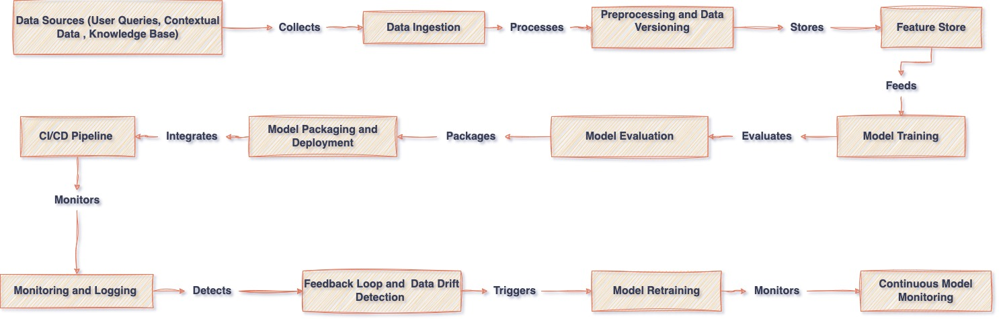

# AI Chatbot

This project is a Retrieval-Augmented Generation (RAG)-based chatbot designed to answer questions from PDF documents. By integrating semantic search with an open-source large language model (LLM), the chatbot can provide accurate, context-aware responses to user queries.

---

## Table of Contents

1. [Features](#features)
2. [Prerequisites](#prerequisites)
3. [Installation](#installation)
4. [Running the Application](#running-the-application)
5. [API Documentation](#api-documentation)
6. [Performance Evaluation](#performance-evaluation)
7. [MLOps Pipeline](#mlops-pipeline)
8. [App Demonstration](#app-demonstration)

---

## Features

- 📄 Simple Interface: Upload PDF documents and submit queries through an easy-to-use interface.
- 🧠 Semantic Search: Retrieves relevant information from the uploaded documents using vector-based search techniques.
- 🖥️ LLM-Powered Answers: Uses an open-source LLM to generate responses based on the retrieved document content.
  Prerequisites

---

## Prerequisites

The following tools and technologies are required to run the application:

- Python 3.8.2+
- PIP 24.2
- [virtualenv](https://virtualenv.pypa.io/en/latest/) (for environment management)

---

## Installation

### Step 1: Clone the Repository

```bash
git clone https://github.com/patiljayesh2025/qp-ai-assessment.git
cd qp-ai-assessment
```

### Step 2: Create a Virtual Environment

You can create a virtual environment using the virtualenv package:

```bash
python -m venv your_env_name
source your_env_name/bin/activate  # On macOS/Linux
env\Scripts\activate  # On Windows
```

### Step 3: Install Dependencies

Once the virtual environment is activated, install the required Python packages::

```bash
pip install --upgrade pip
pip install -r requirements.txt
```

### Step 4 : Create Hugging Face Token

Create a Hugging Face token from the Hugging Face website and assign it the necessary permissions (Permission - Make calls to the serverless Inference API). Then, add the token to the .env file

```
HF_TOKEN = "Your Hugging Face Token"
```

## Running the Application

### Step 1: Start the Uvicorn Server

```bash
 python -m uvicorn app:app --reload
```

### Step 2: Access the App

Wait for application startup to complete , Once the server is running, visit http://127.0.0.1:8000 in your browser.

### Step 3: Explore API Docs

FastAPI automatically generates interactive API documentation:

- Swagger UI: http://127.0.0.1:8000/docs
- ReDoc: http://127.0.0.1:8000/redoc

---

## Performance Evaluation

### Evaluation Metrics

- Accuracy: Measures how often the chatbot's response matches the expected answer.
- Precision: Focuses on the correctness of the positive predictions (useful if your bot gives factual or binary answers).
- Recall: Captures how well the model identifies relevant information.
- F1-Score: The harmonic mean of precision and recall.
- BLEU Score: Commonly used in NLP tasks for comparing machine-generated text with human-generated text.
- ROUGE Score: Another text similarity metric, often used for summarization tasks.
- Human Evaluation: Since LLMs deal with complex and open-ended questions, human evaluators can rate the relevance and usefulness of responses.
- Latency: Time taken to retrieve and generate a response.
- Engagement Metrics: User retention, the number of follow-up queries, and overall satisfaction.

### Implementation Steps:

#### Collect Ground Truth:

- Develop a test set of questions relevant to your RAG system's domain.
- Annotate the expected answers manually or use pre-existing datasets.

#### Build an Evaluation Script:

- Use a method to evaluate responses in bulk. [Here’s](evaluation.py) an example implementation using Python.

### Results

A set of questions and ground truth were defined, and the evaluation results for the chatbot are presented below. You can find the evaluation script [here](evaluation.py)

```json
{
  "Accuracy": 0.8333333333333334,
  "Precision": 0.7142857142857143,
  "Recall": 0.7142857142857143,
  "F1-Score": 0.7142857142857143,
  "Average BLEU": 0.5,
  "Average ROUGE": 0.9166666616666665
}
```

---

## MLOps Pipeline

[](https://drive.google.com/file/d/1dFo1GD8Q3ojWloTZwkoU0HaWTVKpADnb/view?usp=sharing)

---
## App Demonstration

[](https://youtu.be/ooG7O2KKPcY)